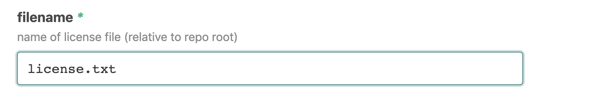
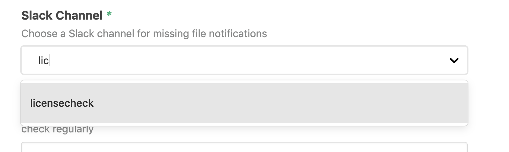

# `@atomist/github-check-repo-contents-skill`

<!---atomist-skill-readme:start--->

# What it's useful for

Either on every Push, or a fixed schedule, validate that all Repos contain a
specific file. Warn in Slack if we discover a Repo that is missing this file.

# Before you get started

Connect and configure these integrations:

1. **GitHub**
2. **Slack**

Both the **GitHub** and **Slack** integrations must be configured in order to
use this skill.

# How to configure

1. **Choose the name of the file that should exist**

    This is a path relative to the root of each repository. All repositories
    should contain this file.

    

2. **Choose a Slack channel for notifications**

    In cases where the file is missing, send a notificatio to this Slack
    Channel.

    

3. **Optionally create a cron schedule**

    Use this to configure the skill to check all of the repositories
    periodically, instead of only on pushes to the repository.

    

4. **Select the set of Repos that should be checked**

    

## How to use Git Check Repo Contents

    All selected repositories will be checked after each Push.  If they are found to be missing the file, a
    Slack notification will be sent.  The skill can also be configured to check all repositories on a periodic schedule.

    Users can also interactively kick off the Skill using Slack.

    ```
    @atomist check all repos
    ```

<!---atomist-skill-readme:end--->

---

Created by [Atomist][atomist]. Need Help? [Join our Slack workspace][slack].

[atomist]: https://atomist.com/ "Atomist - How Teams Deliver Software"
[slack]: https://join.atomist.com/ "Atomist Community Slack"
